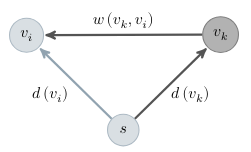
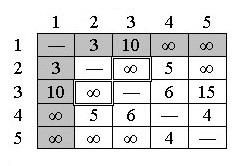
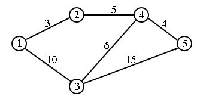

<h1 align="center">Спецификация проекта команды  № 14. 
<h1 align="center">Визуализация алгоритма построения кратчайших путей по алгоритму Флойда-Уоршелла

## Описание проекта
Программа будет представлять визуализацию алгоритма поиска кратчайших путей в графе с использованием алгоритма Флойда-Уоршелла. Интерфейс программы будет включать в себя отображение графа, выделение кратчайших путей между вершинами и изменяющуюся матрицу весов. Пользователь сможет создавать граф или вводить его через матрицу весов. Также пользователь сможет пролистывать работу алгоритма по этапам или сразу видеть результат работы алгоритма.

## Описание алгоритма
Алгоритм начинает работу с матрицы весов (матрицы пометок $𝑑(𝑖, 𝑗))$, рассматриваемых как длины кратчайших путей от вершины $𝑣_𝑖$ к вершине $𝑣_𝑗$, не имеющих ни одной промежуточной вершины, т. е. вес ребра (дуги) ($v_i$, $𝑣_𝑗$). Далее поочередно каждую вершину представляют в роли промежуточной и через нее осуществляют модификацию пометки, т. е. на каждом шаге одну из вершин добавляют к множеству промежуточных вершин. Обозначим пометку вершины А как вещественное число $𝑑(𝐴)$, которое по окончании работы алгоритма означает кратчайшее расстояние, тогда новое значение пометки, согласно алгоритму, будет рассчитываться как 
$$𝑑(𝐴) ∶= min{(𝑑(𝐴), 𝑑(𝐵) + 𝑤(𝐵, 𝐴))}$$
Данное выражение называется правилом модификации пометок , которое можно проиллюстрировать следующим рисунком:
<p align="center">
  
</p>

Условие применимости - в графе нет циклов отрицательной величины. В случае, когда такой цикл есть, алгоритм позволяет найти хотя бы один такой цикл. 
Алгоритм работает за $O(n^3)$ времени и использует $O(n^2)$ памяти. 
Для того, чтобы алгоритм возвращал не только длину кратчайшего пути но и сам путь (дерево кратчайших путей), введем дополнительную матрицу $𝐺$, в которой для каждой пары вершин $𝑢$ и $𝑣$ будем хранить номер первой промежуточной вершины кратчайшего пути из $𝑢$ в $𝑣$.

Опишем работу алгоритма в виде псевдокода:
```
	// Инициализация 
for 𝑖 ← 1, 𝑛 do 
    for 𝑗 ← 1, 𝑛 do 
    𝑑(𝑖, 𝑗) ← 𝑤(𝑖, 𝑗) // Матрицу пометок заполняем весами ребер 
    𝐺(𝑖, 𝑗) ← 𝑖 
    // 𝑣_𝑖 — первая промежуточная вершина пути 𝑣_𝑖 → 𝑣_𝑗 
    end for 
end for 
// Основной алгоритм 
// Внешний цикл идет по промежуточным вершинам 𝑘, внутри него для каждой 
// пары вершин проверяется возможность улучшения их пометки через 𝑘 
for 𝑘 ← 1, 𝑛 do 
    for 𝑖 ← 1, 𝑛 do 
        for 𝑗 ← 1, 𝑛 do 
            if 𝑑(𝑖, 𝑘) + 𝑑(𝑘, 𝑗) < 𝑑(𝑖, 𝑗) then 
                𝑑(𝑖, 𝑗) ← 𝑑(𝑖, 𝑘) + 𝑑(𝑘, 𝑗) 
                𝐺(𝑖, 𝑗) ← 𝐺(𝑘, 𝑗) 
            end if 
        end for 
    end for 
end for // Нахождение кратчайших путей для каждой пары вершин 𝑣_𝑖 , 𝑣_𝑗 


// 𝐿(𝑖, 𝑗) — список вершин кратчайшего пути 𝑣_𝑖 → 𝑣_𝑗 
for 𝑖 ← 1, 𝑛 do 
    for 𝑗 ← 1, 𝑛 do
        𝐿(𝑖, 𝑗) ← ∅ 
        if 𝑑(𝑖, 𝑘) ≠ ∞ then 
            𝑘 = 𝑖 // 𝑣𝑖 — первая вершина пути 𝐿(𝑖, 𝑗) 
            do 
                𝐿(𝑖, 𝑗) ← 𝐿(𝑖, 𝑗) ∪ {𝑘} 
                𝑘 ← 𝐺(𝑘, 𝑗)
            while 𝑘 ≠ 𝐺(𝑘, 𝑗) 
// Если промежуточная вершина подпути 𝑣𝑘 → 𝑣𝑗 совпала с его 
// началом, то других промежуточных вершин на этом подпути нет 
                𝐿(𝑖, 𝑗) ← 𝐿(𝑖, 𝑗) ∪ {𝑗}
// Добавляем в список 𝐿(𝑖, 𝑗) последнюю вершину пути 𝑣𝑖 → 𝑣𝑗 
        end if 
    end for 
end for
```
## Интерфейс программы
1. Отображение графа: Программа будет позволять пользователю
визуально создавать и редактировать граф, добавляя вершины и рёбра с редактирования матрицы весов.
Предполагается, что матрица весов будет выглядеть следующим образом:

<p align="center">
  
</p>

Визуальное представление графа:

<p align="center">
  
</p>


2. Анимация алгоритма: Пользователь сможет запустить алгоритм Флойда-Уоршелла на созданном графе и наблюдать шаг за шагом, как алгоритм находит кратчайшие пути между всеми парами вершин. Визуализация будет показывать изменения в матрице расстояний на каждом шаге алгоритма.
3. Интерактивность: Пользователь сможет взаимодействовать с визуализацией, приостанавливая, возобновляя или шагая по алгоритму по своему усмотрению. Также будет добавлена возможность выбора режима - показывать работу алгоритма по шагам или готовое представление дерева кратчайших путей. 

## План выполнения
1. 1 июля (понедельник): сдача прототипа проекта.
    1. Разработка базового функционала программы, создание визуального представления приложения.
    2. Реализация основной логики алгоритма Флойда-Уоршелла для нахождения кратчайших путей между всеми парами вершин.
2. 5 июля (пятница): сдача первой версии.
    1. Доработка интерфейса программы.
    2. Полная реализация алгоритма в соответствии с описанием в предыдущем пункте. 
3. 8 июля (понедельник): сдача второй версии.
    1. Оптимизация кода и улучшение производительности программы.
    2. Добавление функционала для визуализации шагов алгоритма Флойда-Уоршелла.
    3. Подготовка к финальной сдаче, проверка соответствия всем требованиям проекта.
4. 9 июля (вторник): сдача финальной версии программы с отчётом.
    1. Финальная проверка программы на наличие ошибок и исправление последних недочетов.
    2. Подготовка отчёта о проделанной работе, включая описание функционала программы, инструкции по использованию и примеры работы.
    3. Сдача финальной версии программы и отчёта.

## Распределение ролей

1. Дарья Биктагирова - отвечает за разработку основной логики программы, включая алгоритмы и функциональность, а также за написание отчета по фрагментам своего кода.
2. Дарья Малюская - отвечает за дизайн и внешний вид программы, а также за написание основной части отчета, описывающей общую концепцию проекта и его результаты.
